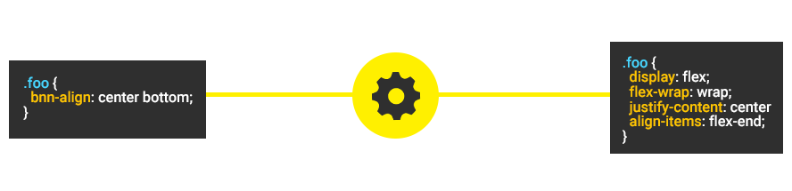
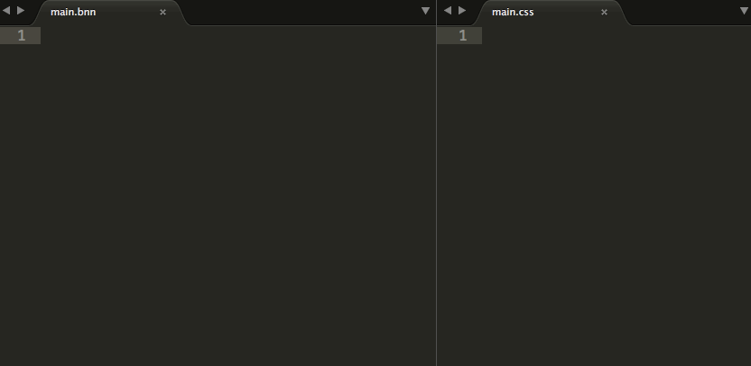

# Banana CSS

> :banana: The Brazilian CSS superset.

[](https://travis-ci.org/bananacss/bananacss)
[](https://coveralls.io/github/bananacss/bananacss?branch=master)
[](https://david-dm.org/bananacss/bananacss)
[](https://david-dm.org/bananacss/bananacss#info=devDependencies)
[](https://www.npmjs.com/package/bananacss)
[](https://www.npmjs.com/package/bananacss)

## What is?

- Syntax **abstractions** for complex native CSS features.
- If you can, compile native CSS features like a **pre-processor** (ex: Custom properties and @import).
- Provide a simple abstraction for a **Semantic Grid System** with calc().
- **Extra** features (ex: **@function**).

## How it works?



## Table of contents

- [How to install](#how-to-install)
- [Command Line Usage](#command-line-usage)
- [Module Usage](#module-usage)
- [Features](#features)
- [Example](#example)
- [Development](#development)
  - [Code Style](#code-style)
  - [Code Docs](#code-docs)
  - [Tests](#tests)
- [Versioning](#versioning)
- [Contributing](#contributing)
- [History](#history)
- [License](#license)

<hr>

## How to install

Verify if you have [node](http://nodejs.org/) and [npm](https://www.npmjs.org/) installed.

### Command Line

```sh
$ npm install -g bananacss
```

### Module

```sh
$ npm install bananacss --save
```

<hr>

## Command Line Usage

*Compile you .bnn file to .css*

```sh
$ banana <input_path>
```

*Watch for changes.*

```sh
$ banana <input_path> -w
```

*Output to dir when passing files.*

```sh
$ banana <input_path> -o <out_path>
```

*Show the project version.*

```sh
$ banana --version
```

*Show all available commands.*

```sh
$ banana --help
```

<hr>

## Module Usage

```js
const inputBananaCode = '.a {bnn-size: 50px;}';

// Features injection
const config = {};
config.bnnSize = true; // Default: false
config.bnnPosition = true; // Default: false
config.bnnGradient = true; // Default: false
config.bnnVariable = true; // Default: false
config.bnnImport = true; // Default: false
config.bnnAlign = true; // Default: false
config.bnnWidth = true; // Default: false
config.bnnHeight = true; // Default: false
config.bnnCol = true; // Default: false
config.bnnRow = true; // Default: false
config.bnnBox = true; // Default: false
config.bnnFunction = true; // Default: false
config.compress = true; // Default: false

const Banana = require('banana')(config);

// Output the css
const output = Banana.render(inputBananaCode);

console.log(output); // .a {width: 50px; height: 50px;}
```

<hr>

## Features

- [bnn-size](docs/bnn-size.md) property.
- [bnn-position](docs/bnn-position.md) property.
- [bnn-gradient](docs/bnn-gradient.md) property.
- [bnn-align](docs/bnn-align.md) property.
- [bnn-width](docs/bnn-width.md) property.
- [bnn-height](docs/bnn-height.md) property.
- Intuitive box model with [bnn-box](docs/bnn-box.md) property and inside/outside values.
- Customizable [Grid System](docs/grid-system.md) with `bnn-row` and `bnn-col`.
- [Module Bundler](docs/module-bundler.md) with native `@import` syntax.
- Global [variables](docs/variables.md) with native custom properties syntax.
- Create reusable functions with [@function](docs/functions.md).
- Minify/Compress the generated CSS.

View all [features docs here](docs/index.md).

<hr>

## Example



<hr>

## Development

### Code Style

Follow the [Banana NodeJS style guide](https://github.com/bananacss/banana-style-guide).

*Validate the code style with [ESLint](http://eslint.org/):*
```sh
$ npm run eslint
```

### Code Docs

*Generate code docs with [JSDocs](http://usejsdoc.org/)*
```sh
$ npm run jsdocs
```

View code docs in `out/index.html`

### Tests

*Run the unit tests with [mocha](https://mochajs.org/):*
```sh
$ npm test
```

*Calculate the coverage with [Istanbul](https://gotwarlost.github.io/istanbul/):*
```sh
$ npm run cover
```

<hr>

## Versioning

To keep better organization of releases we follow the [Semantic Versioning 2.0.0](http://semver.org/) guidelines.

## Contributing

Find on our [issues](https://github.com/bananacss/bananacss/issues/) the next steps of the project ;)
<br>
Want to contribute? [Follow these recommendations](https://github.com/bananacss/bananacss/blob/master/CONTRIBUTING.md).

## History

See [Releases](https://github.com/bananacss/bananacss/releases) for detailed changelog.

## License

[MIT License](https://github.com/bananacss/bananacss/blob/master/LICENSE.md) © [Afonso Pacifer](http://afonsopacifer.com/)
